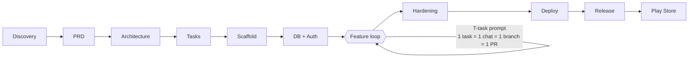

# vibe-blueprint

[](https://github.com/surajse/vibe-blueprint/actions/workflows/ci.yml)
[](LICENSE)

**Make AI-assisted ("vibe") coding reliable.** A GitHub template repository that
keeps context in files (not chat), enforces strict rules, slices work into small
tasks, and verifies everything with automated gates.

The full playbook — 100-question debate, 7-layer anti-hallucination system,
prompts, stack, architecture, PRD — lives in [`docs/BLUEPRINT.md`](docs/BLUEPRINT.md).

> Tested with: Node 24.21.0, pnpm 12.9.1 — 2026-10-04. Re-verify quarterly.

## Why

LLMs are probabilistic: they write the most _plausible_ next token, not the most
_correct_ one. "Zero mistakes" from any AI is impossible. The realistic goal:

> A mistake gets **caught automatically within minutes** (tests, types, CI),
> and **context lives in files, not in chat**.

```
Hallucination ↓  =  Grounding ↑  +  Task size ↓  +  Verification ↑  +  Memory in files
```

## 5-minute quick start

1. **Use this template** on GitHub → clone your new repo.
2. `pnpm install`
3. Open in Cursor → start at `prompts/P0-discovery.md` (P0 → P10, one phase per chat).
4. Feature work: pick the next task from `docs/TASKS.md`, open a **new chat**, paste `prompts/T-task.md`.

> Template maintainers: the repo-building prompt lives in [`docs/MAINTAINERS.md`](docs/MAINTAINERS.md) — do not run it on an app repo.

## Workflow



**Daily loop (every feature):**

1. Pick the next task from `docs/TASKS.md`
2. New chat. Attach `@AGENTS.md @docs/PROGRESS.md @docs/ARCHITECTURE.md @docs/tasks/T-xxx.md`
3. Plan first (no code) → approve the plan
4. Tests first (failing) → commit
5. Implement inside the scope fence
6. `pnpm verify` → look at the real output
7. Self-review + your click-through
8. Commit → PR → CI green
9. Update `docs/PROGRESS.md` (+ ADR if a decision was made)
10. Close the chat

## Folder map

```
vibe-blueprint/
├── AGENTS.md                 # AI reads this first, every session
├── .cursor/rules/*.mdc       # behaviour guardrails (core, security, web, mobile, db, testing)
├── docs/
│   ├── BLUEPRINT.md          # the full playbook (links to real files, never embeds them)
│   ├── MAINTAINERS.md        # template maintainers: repo-building prompt
│   ├── QA.md                 # 100-question debate on AI drift
│   ├── FRESHNESS.md          # dated facts: fact | source | checked date
│   ├── PRD.md / ARCHITECTURE.md / TECH_STACK.md
│   ├── ENVIRONMENTS.md / RELEASE.md / RUNBOOK.md / OBSERVABILITY.md
│   ├── PLAY_STORE.md / WEB_LAUNCH.md   # production launch checklists
│   ├── TOOLING.md            # Cursor / Antigravity / Codex / Claude Code adapters
│   ├── UX.md                 # P2b wireframes  +  DATA_INVENTORY.md (Play Data Safety source)
│   ├── DATA_MODEL.md / API_CONTRACT.md / DESIGN_SYSTEM.md / SECURITY.md / TESTING.md
│   ├── PROGRESS.md           # living memory — update after EVERY task
│   ├── TASKS.md + tasks/     # vertical-slice tasks
│   ├── BACKLOG.md            # scope-creep parking lot  +  GLOSSARY.md (domain terms)
│   └── decisions/            # ADRs
├── prompts/                  # P0–P10 (+P2b UX) phase prompts + T/D/R/V/H/M reusable prompts
├── packages/shared/          # walking skeleton: 1 function + 1 test (green from commit 1)
├── scripts/check-docs.mjs    # fails if prompts/rules reference files that don't exist
├── scripts/verify.mjs        # pnpm verify: format → lint → typecheck → test → build (cross-platform)
└── .github/                  # CI (verify + gitleaks + CodeQL), freshness reminder, PR/issue templates, Dependabot
```

## The 7 layers

| Layer           | What                                 | Files                                    |
| --------------- | ------------------------------------ | ---------------------------------------- |
| L1 Spec         | Testable definition of what to build | `docs/PRD.md`                            |
| L2 Memory       | Context in files, not chat           | `AGENTS.md`, `docs/PROGRESS.md`, ADRs    |
| L3 Rules        | Behaviour guardrails                 | `.cursor/rules/*.mdc`                    |
| L4 Grounding    | Real sources, never guesses          | docs, generated types, Zod, MCP          |
| L5 Task slicing | Small bounded work                   | `docs/TASKS.md`, 1 task = 1 chat         |
| L6 Gates        | Machine verification                 | `pnpm verify`, CI, e2e, CodeQL, gitleaks |
| L7 Review & Ops | Humans + monitoring                  | PR template, Sentry, preview deploys     |

## Production targets

| Target                                | Covered by                                                                              |
| ------------------------------------- | --------------------------------------------------------------------------------------- |
| Website                               | `docs/WEB_LAUNCH.md`, `prompts/P8-deploy.md`, `prompts/P9-release.md`                   |
| Android / Google Play                 | `docs/PLAY_STORE.md`, `.cursor/rules/035-android-play.mdc`, `prompts/P10-play-store.md` |
| Google Play gates verified 2026-10-04 | target API 36; personal accounts need a 12-tester / 14-day closed test                  |

## FAQ

**Can this guarantee zero mistakes from the AI?**
No — and anyone promising that is selling something. LLMs are probabilistic.
What this repo guarantees is _defense in depth_: spec → rules → small tasks →
gates → review → monitoring → rollback. Every layer catches the other layers'
mistakes, so a mistake surfaces in minutes instead of in production.

**Do I need to know how to code?**
You don't need to read code to verify _behavior_: every task has acceptance
criteria you can click through on a preview deploy, plus a second-AI reviewer
prompt (`prompts/V-review.md`). But someone on the team should be able to read
a diff before merging to `main`.

**Cursor only?**
Cursor is the primary workflow, but the repo is platform-agnostic:
`AGENTS.md` doubles as custom instructions / `CLAUDE.md`, `prompts/*.md` paste
anywhere, and the GitHub repo stays the single source of truth.

**Why pnpm + Turborepo + TypeScript strict?**
One shared type system across web and mobile, one `pnpm verify` command, and a
compiler that catches AI mistakes before humans have to.

**What Node/pnpm versions do I need?**
Node 24.21.0 (pinned in `.nvmrc`) and pnpm 12.9.1 (`packageManager` in
`package.json`). Check with `node -v` / `pnpm -v`. If your pnpm is older, update
it first — an old pnpm against a new `packageManager` pin fails confusingly.
Current pins are tracked in `docs/FRESHNESS.md`.

**Secrets scan fails on my organization's repo?**
`gitleaks-action` requires a (free) `GITLEAKS_LICENSE` for organization-owned
repos — personal repos don't need it. Get a key at gitleaks.io and add it as a
repo secret named `GITLEAKS_LICENSE`.

## Contributing

See [CONTRIBUTING.md](CONTRIBUTING.md). "Gotchas learned" contributions —
mistakes your AI made and the correct fact — are especially welcome.

## License

MIT — see [LICENSE](LICENSE).
