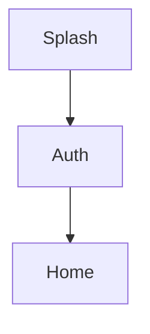
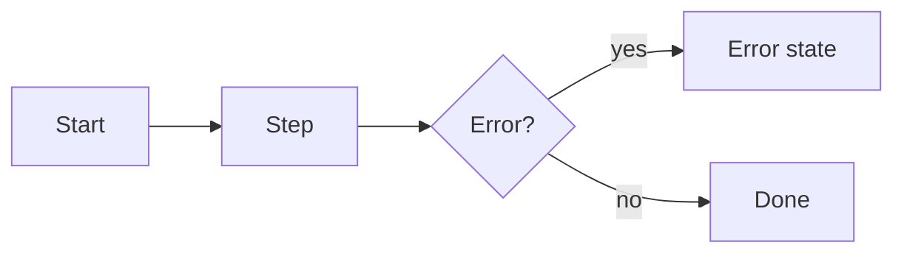

# UX — <Product name>

Status: draft | approved · Last updated: <date>

Filled by `prompts/P2b-ux-wireframes.md`. No visual decisions beyond `DESIGN_SYSTEM.md` tokens.

## 1. Screen inventory

| ID  | Screen | Platform | FR/US refs | Notes |
| --- | ------ | -------- | ---------- | ----- |

## 2. Navigation map



## 3. User journeys (P0)

### J-001 <name>



## 4. Wireframes (low-fi)

### SC-001 <screen>

```text
+--------------------------------------+
| <- Title                        [ + ]|
|--------------------------------------|
| [ list item ................. > ]     |
|                                      |
| [      Primary action       ]        |
+--------------------------------------+
```

States: loading / empty / error / offline (describe each).

## 5. Copy table

| Key | English |
| --- | ------- |

## 6. Accessibility + Android checks

- Touch targets >= 48dp · contrast · screen-reader labels · focus order
- Back button, safe areas, keyboard, permission rationale, 360dp width

## 7. Traceability

| SC ID | FR ID |
| ----- | ----- |

## 8. Open questions
